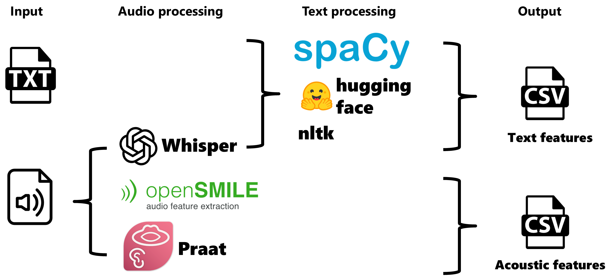

# Summary

The automatic extraction of linguistic and acoustic features from speech is essential for analysing speech in neuroscience and clinical research. Speechmetryflow is an open-source pipeline, built using Python, Nextflow [@di_tommaso_nextflow_2017] and Apptainer [@kurtzer_hpcngsingularity_2021], to enable large-scale, offline, reproducible speech preprocessing and feature extraction. The pipeline currently supports English and French, and extracts general features applicable to any mono-speaker speech task, depending on the length of the sample (for example, features that calculate over a window size of tokens). Features specific to two picture description tasks commonly used in clinical speech evaluation - the Cookie Theft and the Picnic Scene - relating to predetermined information content units specific to each image can also be extracted. For multi-speaker speech samples, we recommended that users first conduct diarisation to isolate utterances from a single speaker. The extracted features can be easily used in downstream tasks such as classification.

# Statement of need

Speech analysis has long been used across various fields of human sciences, including sociolinguistics, education and literacy, psychology and mental health, and political science. A growing body of evidence suggests that it has strong potential as an early biomarker for different clinical populations. However, its adoption in clinical settings remains limited due to the lack of automated analysis pipelines. The role of speech in diagnosing and monitoring disease has led to a demand for tools that automate the extraction of linguistic and acoustic features at scale. This need will continue to increase with advances in automatic speech recognition (ASR) that should enable faster, more accurate transcription of speech tasks. The majority of existing feature extraction pipelines either focus on a narrow subset of features or are not freely available, leading to more complex workflows (utilising multiple tools) that lack reproducibility. Efforts are often duplicated across researchers and teams, using more resources and time. This is compounded by the complexities of speech analyses, in which careful consideration must be given at different steps of the pipeline (for example, lemmatisation versus stemming). Speechmetryflow combines extensive text features from multiple linguistic domains, with established acoustic features implemented in the same workflow, offering a user-friendly "one-stop shop" for comprehensive speech analysis that works out-of-the-box, using the command line. Text features have been implemented according to current best practice in neuroscience and clinical research, ensuring consistency and reproducibility across studies.

# Software design

To enable the user to run the pipeline without an internet connection, the first step is to build the different containers using the provided Apptainer recipes.

Subsequently, input data may be in audio, text, or a combination of both formats. It is not necessary to provide all formats for each participant. It is also possible to provide multiple audio or text files for the same participant.

The acoustic pipeline processes WAV audio files and extracts features using Parselmouth [@jadoul_parselmouth_2018], the Python interface of Praat [@boersma_praat_2003], including duration, pitch, jitter, shimmer, formant and mel frequency cepstral coefficient features, as well as implementing the Praat toolbox "uhm-o-meter" [@de_jong_uhmometer_2021] to assess fluency speed and breakdown, measuring silent pauses and filled pauses. Using the Python interface of OpenSmile [@eyben_opensmile_2010], Speechmetryflow extracts the Geneva Minimalistic Acoustic Parameter Set [@eyben_gemaps_2016] a minimal set of voice parameters selected based on their potential to index affective physiological changes in voice production, and their proven value in former studies. Each set of parameters results in a CSV file containing the features. Audio files are also automatically transcribed with whisperX [@bain_whisperx_2022], an implementation of whisper [@radford_robust_2022].

The text processing pipeline accepts, in parallel, TXT files provided by the user and the automatic transcriptions obtained from the acoustic pipeline. It implements tokenization, part-of-speech tagging, syntactic parsing, lemmatization and feature extraction, outputting a csv file including measures of speech production, lexical diversity, lexico-semantics, syntactic complexity, coherence and psycholinguistics. Text features are extracted with the Python libraries NLTK [@bird_nltk_2009] and TextDescriptives [@hansen_textdescriptives_2023], which use spaCy [@montani_spacy_2023]. The largest spaCy pre-trained statistical model is utilised: en_core_web_lg (343k unique vectors in 300 dimensions) for English and fr_core_news_lg (500k unique vectors in 300 dimensions) for French. Features describing feelings and emotions are also calculated using models available on Hugging Face [@barbieri_xlm-t_2022] [@raffel_exploring_2023]. An overview of the workflow can be seen in \autoref{overview}.

The pipeline uses nextflow, which enables the provision of detailed execution metrics, including CPU usage, memory consumption, runtime duration, and disk I/O statistics for each process, as well as error messages and debugging information.

# State of the field

Although there are several tools, such as those mentioned in the software design section, for extracting linguistic and acoustic features from speech, to the best of our knowledge, there is no pipeline that integrates all of these tools to ensure reproducibility.

# Research impact statement

Speechmetryflow features have already been reported in several peer-reviewed publications [@slegers_cortex_2021] [@pellerin_jad_2025].

# AI usage disclosure

LLMs available online, such as OpenAI's ChatGPT and Anthropic's Claude, were used to supplement the code documentation and as general programming aids. No agentic tools were used in the development. All AI suggestions were thoroughly verified before being incorporated into the software. No generative AI tools were used in the writing of this manuscript or the preparation of supporting materials.

# Acknowledgements

The study is funded by the Natural Sciences and Engineering Research Council of Canada (NSERC) and the Chaire Courtois en recherche fondamentale III (neuroscience) de l’Université de Montréal. NC is funded by a Postdoctoral Fellowship from the Canadian Consortium on Neurodegeneration in Aging Sex & Gender Hub.

# Availability

Speechmetryflow is distributed as open-source software. Its source code, documentation, and usage examples are available at [https://github.com/lingualab/speechmetryflow](https://github.com/lingualab/speechmetryflow). Contributions as well as community feedback are encouraged.

# References

